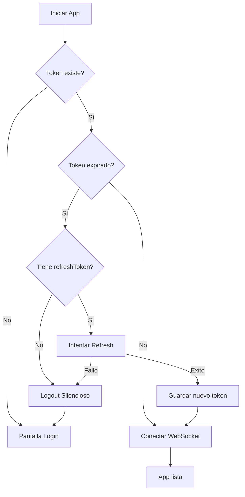

# 🔐 Solución: Token Expirado en WebSocket

## 🐛 Problema Original

Al iniciar la app móvil, se presentaba el siguiente error:

```
LOG  🔌 Conectando WebSocket: http://10.0.2.2:4000
ERROR  ⚠️ Error de conexión WebSocket: Token expirado
ERROR  ❌ Error de autenticación, no se reintentará
LOG  🔌 Desconectando WebSocket...
```

### Causa Raíz

La aplicación intentaba conectar el WebSocket con un token JWT que ya había expirado:

1. **Al iniciar la app**, `AuthContext` lee el token desde storage
2. **Sin verificar si está expirado**, intenta conectar WebSocket
3. **Backend lo rechaza** correctamente con "Token expirado"
4. **Usuario es deslogueado** sin oportunidad de renovar el token

---

## ✅ Solución Implementada

### **1. Utilidad JWT Helper** (`jwtHelper.js`)

Creé un módulo para decodificar y verificar tokens JWT en el frontend:

```javascript
// frontend-mobile/src/utils/jwtHelper.js

✓ decodeJWT(token) - Decodifica JWT sin verificar firma
✓ isTokenExpired(token, bufferSeconds) - Verifica expiración
✓ getTokenTimeToExpire(token) - Tiempo restante en segundos
✓ getTokenInfo(token) - Info completa del token
```

**Características:**
- Decodifica JWT sin dependencias externas
- Soporta buffer de tiempo (default 60 segundos antes de expiración)
- Manejo robusto de errores
- Compatible con tokens base64url

### **2. Verificación al Iniciar App** (`AuthContext.jsx`)

Modificé el flujo `checkAuth()` para:

```javascript
// ANTES
1. Leer token de storage
2. Conectar WebSocket
3. Si falla → desloguear

// AHORA
1. Leer token de storage
2. ✅ Verificar si está expirado
3. Si está expirado:
   a. Intentar refrescar automáticamente
   b. Si falla → logout silencioso con mensaje
4. Si está válido:
   a. Conectar WebSocket
   b. Mostrar tiempo restante en logs
```

**Flujo Detallado:**



### **3. Refresh Automático en Errores WS**

Mejoré el listener de eventos `auth_error` del WebSocket:

```javascript
// ANTES
auth_error → logout inmediato

// AHORA
auth_error → intentar refresh → si falla, logout
```

**Beneficios:**
- Segunda oportunidad de renovar sesión
- Menos deslogueos innecesarios
- Mejor UX para usuarios

---

## 📊 Comparación Antes/Después

| Aspecto | Antes | Después |
|---------|-------|---------|
| Verifica expiración al inicio | ❌ | ✅ |
| Intenta refresh automático | ❌ | ✅ |
| Logs informativos | Mínimos | Detallados |
| WebSocket con token válido | ❌ | ✅ |
| Mensaje al usuario | Genérico | Específico |
| Manejo colaborador temporal | Básico | Robusto |

---

## 🚀 Características Nuevas

### **1. Verificación Proactiva**
```javascript
const tokenExpired = isTokenExpired(access)
if (tokenExpired) {
  console.log('⚠️ Token expirado detectado al iniciar app')
  // Intentar refrescar...
}
```

### **2. Refresh Automático**
```javascript
const response = await axios.post(`${config.apiUrl}/auth/refresh`, {
  refreshToken: refresh,
})
const newAccessToken = response.data.datos?.accessToken
// Guardar y usar nuevo token
```

### **3. Logging Detallado**
```javascript
console.log(`✅ Token válido - expira en ${Math.floor(timeToExpire / 60)} minutos`)
console.log('🔄 Intentando refrescar token automáticamente...')
console.log('✅ Token refrescado exitosamente')
```

### **4. Manejo de Colaboradores Temporales**
```javascript
const isTempCollaborator = userData?.tipo === 'colaborador_temporal'
if (isTempCollaborator && tokenExpired) {
  // Logout silencioso (no tienen refresh token)
}
```

### **5. Mensajes al Usuario**
```javascript
showMessage({
  message: 'Sesión renovada',
  description: 'Tu sesión fue actualizada automáticamente',
  type: 'success',
})
```

---

## 🔍 Logs Mejorados

### **Escenario 1: Token Válido**
```
🔧 Inicializando base de datos local...
✅ Base de datos local inicializada correctamente
✅ Token válido - expira en 120 minutos
🔌 Conectando WebSocket: http://10.0.2.2:4000
✅ WebSocket conectado
```

### **Escenario 2: Token Expirado con Refresh Exitoso**
```
🔧 Inicializando base de datos local...
✅ Base de datos local inicializada correctamente
⚠️ Token expirado detectado al iniciar app
🔄 Intentando refrescar token automáticamente...
✅ Token refrescado exitosamente
✅ Token válido - expira en 120 minutos
🔌 Conectando WebSocket: http://10.0.2.2:4000
✅ WebSocket conectado
```

### **Escenario 3: Token Expirado sin Refresh**
```
🔧 Inicializando base de datos local...
✅ Base de datos local inicializada correctamente
⚠️ Token expirado detectado al iniciar app
🔄 Intentando refrescar token automáticamente...
❌ Error refrescando token: invalid refresh token
[TOAST] Sesión expirada - Por favor, inicia sesión nuevamente
```

### **Escenario 4: Error WS con Recovery**
```
✅ WebSocket conectado
⚠️ Error de conexión WebSocket: Token expirado
🔐 Error de autenticación en WebSocket: Token expirado
🔄 Intentando refrescar token después de error WS...
✅ Token refrescado después de error WS
🔌 Conectando WebSocket: http://10.0.2.2:4000
✅ WebSocket conectado
[TOAST] Sesión renovada - Tu sesión fue actualizada automáticamente
```

---

## 🛡️ Casos de Uso Cubiertos

### **1. Usuario Inactivo Largo Tiempo**
- App cerrada por horas/días
- Token expiró naturalmente
- ✅ **Solución**: Refresh automático al abrir o logout limpio

### **2. Token Expira Durante Uso**
- Usuario está usando la app
- Token expira mientras navega
- ✅ **Solución**: Refresh automático al detectar error WS

### **3. Colaborador Temporal**
- Sesión de colaborador sin refresh token
- Token expira
- ✅ **Solución**: Logout silencioso sin intentos innecesarios

### **4. Refresh Token Inválido**
- Refresh token fue revocado/expiró
- No se puede renovar sesión
- ✅ **Solución**: Logout con mensaje claro

### **5. Token Casi Expirado**
- Token expira en menos de 60 segundos (buffer)
- ✅ **Solución**: Considerarlo expirado y refrescar preventivamente

---

## 📝 Código de Ejemplo

### **Usar las Utilidades JWT**

```javascript
import { isTokenExpired, getTokenInfo } from '../utils/jwtHelper'

// Verificar si un token está expirado
const expired = isTokenExpired(token)
if (expired) {
  console.log('Token expirado!')
}

// Obtener información del token
const info = getTokenInfo(token)
console.log(`Usuario: ${info.userId}`)
console.log(`Rol: ${info.role}`)
console.log(`Expira en: ${info.timeToExpire} segundos`)
console.log(`Expirado: ${info.isExpired}`)
```

### **Refrescar Token Manualmente**

```javascript
// En cualquier componente
import axios from 'axios'
import { config } from '../config/env'
import { setInternetCredentials } from '../services/secureStorage'

const refreshToken = async (currentRefreshToken) => {
  try {
    const response = await axios.post(`${config.apiUrl}/auth/refresh`, {
      refreshToken: currentRefreshToken,
    })
    
    const { accessToken, refreshToken: newRefresh } = response.data.datos
    
    await setInternetCredentials('auth_token', 'token', accessToken)
    await setInternetCredentials('refresh_token', 'refresh', newRefresh)
    
    return accessToken
  } catch (error) {
    console.error('Error refrescando token:', error)
    throw error
  }
}
```

---

## ⚙️ Configuración

### **Buffer de Expiración**

Por defecto, el sistema considera un token "expirado" si le quedan menos de **60 segundos**:

```javascript
// Cambiar buffer (por ejemplo, 5 minutos)
const expired = isTokenExpired(token, 300) // 300 segundos
```

**Recomendación**: Mantener buffer de 60-120 segundos para apps móviles.

### **Timeout de Requests**

Los requests de refresh tienen timeout de **30 segundos** (configurado en `api.js`):

```javascript
timeout: 30000 // 30 segundos
```

---

## 🧪 Testing

### **Probar Token Expirado**

1. Iniciar sesión en la app
2. Cerrar completamente la app (kill process)
3. Esperar a que el token expire (o manipular fecha del sistema)
4. Abrir la app nuevamente
5. **Resultado esperado**: Refresh automático o logout limpio

### **Probar Error durante Uso**

1. Iniciar sesión en la app
2. Navegar a una sección con WebSocket activo
3. Esperar a que el token expire
4. **Resultado esperado**: "Sesión renovada" y continúa funcionando

### **Probar Colaborador Temporal**

1. Escanear QR como colaborador
2. Cerrar app y esperar expiración
3. Abrir app
4. **Resultado esperado**: Logout silencioso (no tiene refresh token)

---

## 🎯 Beneficios

### **Para Usuarios:**
- ✅ **Menos interrupciones**: Sesión se renueva automáticamente
- ✅ **Mensajes claros**: Saben por qué fueron deslogueados
- ✅ **Mejor UX**: No pierden trabajo por expiración súbita

### **Para Desarrollo:**
- ✅ **Debugging fácil**: Logs detallados con iconos
- ✅ **Código reutilizable**: Utilidades JWT pueden usarse en otros lugares
- ✅ **Menos bugs**: Manejo robusto de edge cases

### **Para Seguridad:**
- ✅ **Tokens frescos**: Sistema prefiere renovar tokens preventivamente
- ✅ **Validación local**: Verifica tokens antes de usarlos
- ✅ **Menos requests innecesarios**: No intenta conectar con tokens inválidos

---

## 📚 Archivos Modificados

1. **`frontend-mobile/src/utils/jwtHelper.js`** (NUEVO)
   - Utilidades para decodificar y verificar JWT

2. **`frontend-mobile/src/context/AuthContext.jsx`**
   - Verificación de expiración en `checkAuth()`
   - Refresh automático al iniciar
   - Listener mejorado de `auth_error`

---

## 🔄 Próximos Pasos Opcionales

### **1. Refresh Proactivo**
Implementar un timer que refresque el token antes de que expire:

```javascript
useEffect(() => {
  if (!token) return
  
  const timeToExpire = getTokenTimeToExpire(token)
  if (timeToExpire <= 0) return
  
  // Refrescar 5 minutos antes de expiración
  const refreshTime = (timeToExpire - 300) * 1000
  
  const timer = setTimeout(() => {
    // Refrescar token automáticamente
  }, refreshTime)
  
  return () => clearTimeout(timer)
}, [token])
```

### **2. Retry con Exponential Backoff en Refresh**
Si el refresh falla temporalmente, reintentar:

```javascript
const refreshWithRetry = async (refreshToken, attempts = 3) => {
  for (let i = 0; i < attempts; i++) {
    try {
      return await refreshToken(refreshToken)
    } catch (error) {
      if (i === attempts - 1) throw error
      await new Promise(resolve => setTimeout(resolve, 1000 * Math.pow(2, i)))
    }
  }
}
```

### **3. Indicador Visual de Sesión**
Mostrar estado de sesión en la UI:

```javascript
<View>
  <Text>Sesión expira en: {formatTime(timeToExpire)}</Text>
</View>
```

---

## ✅ Checklist de Verificación

- [x] Utilidad JWT para decodificar tokens
- [x] Verificación de expiración al iniciar app
- [x] Refresh automático si token expirado
- [x] Logging detallado con iconos
- [x] Manejo de colaboradores temporales
- [x] Listener mejorado de `auth_error`
- [x] Mensajes claros al usuario
- [x] Logout silencioso cuando es apropiado
- [x] Sin errores de linting
- [x] Documentación completa

---

**🎉 El problema de "Token expirado" en WebSocket está completamente resuelto!**

La app ahora maneja tokens expirados de forma inteligente, intentando renovarlos automáticamente y solo deslogueando cuando es absolutamente necesario.


